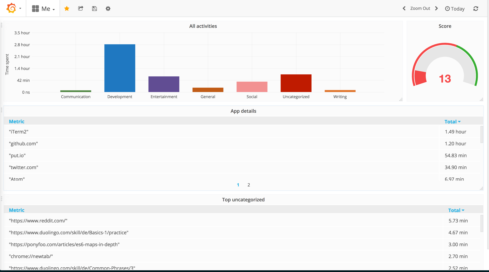

# tracker

`tracker` uses awesome open source technology:

- [Go](https://golang.org)
- [Grafana](https://github.com/grafana/grafana)
- [InfluxDB](https://github.com/influxdata/influxdb)

# Current status of the project

I wrote `tracker` to play around with InfluxDB and Grafana. I open sourced it
so I could write on my blog about the experience. At the moment, the project
has the following limitations:

- It works only on mac.
- It tracks only Google Chrome activity.
- It has *no* configuration so it assumes db name and credentials for
  InfluxDB.
- It has no logging.
- The default set of [categories](/categories.csv) is too small.
- There is no way to override default categories.

Please have a look at the
[roadmap](https://github.com/lucapette/tracker/projects/1) for more details.

# Installation guide

## Standalone

`tracker` can be installed as an executable. Download the latest [compiled
binaries](https://github.com/lucapette/tracker/releases) and put it anywhere
in your executable path.

## Source

Please refer to our [contributing guidelines](/CONTRIBUTING.md) to build and
install `tracker` from the source.

# Code of Conduct

You are expected to follow our [code of conduct](/CODE_OF_CONDUCT.md) when
interacting with the projects via issues, pull requests or in any other form.
Many thanks to the awesome [contributor
covenant](http://contributor-covenant.org/) initiative!

# License

[MIT License](/LICENSE) Copyright (c) [2017] [Luca Pette](http://lucapette.me)
